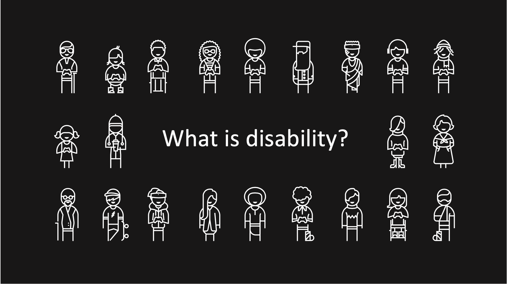
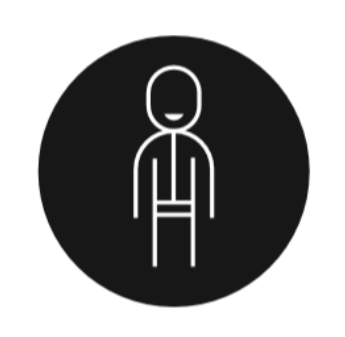
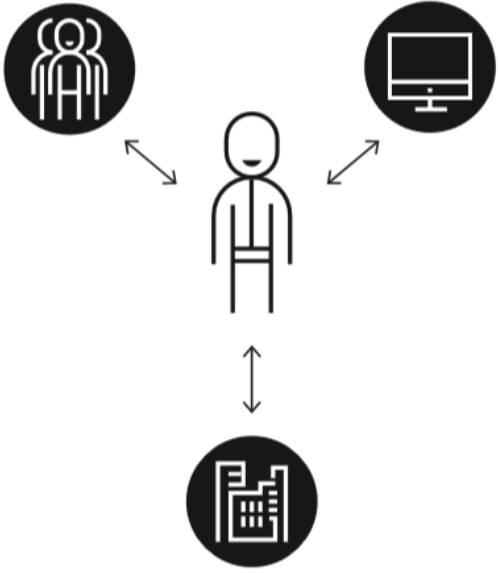
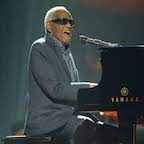
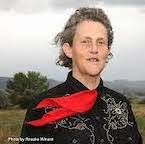
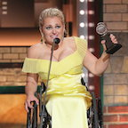
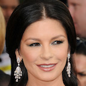

<!-- .element: class="h-stretch"  -->

---
## Disability is a context-dependent mismatch 

Note:

**Disability as a personal attribute**
"restriction or lack of ability ... within the range considered normal"
Older views (1980s). This **medical model** asks how do we *fix people*:

**Disability as a societal consequence**
"the interaction between features of a person's body and ... [their] society"
More recent views (2000s). This **social model** asking how do we *fix society*

---

## Neither is quite right

- Medical Model: how do we fix people
<!-- .element: class="fragment"  -->
- Social Model: how do we fix society
<!-- .element: class="fragment"  -->
- Postmodern--Disability doesn't need to be fixed. Disability is celebrated as part of human variation. Disability pride, disability culture, and disabled joy are all things to support and celebrate. <!-- .element: class="fragment"  -->

---
## Worldwide Stats

| Visual | Hearing | Neurodiversity | Speech | Mobility | Mental Health |
|--|--|--|--|--|--|
|  |  |   |       |       |  |
| Ray Charles  | Marlee Matlin | Temple Grandin | President Biden | Ali Stroker | Catherine Zeta-Jones|
| *Colorblind* *Visual Impairment* *Blind* | *Hearing loss*   *Deaf* | *Dyslexia*   *Autism*   *PTSD* | *Stutter*   *Nonspeaking*   *Dyspraxia* | *Quadriplegia*   *Limb different* | *Bipolar* *Anxiety* *PTSD* *Depression*  |

Notes:
1 Billion (~15%) of population [WHO'11]; 
19% of USA [Census'12]

call out that you don't have to be famous to be proud of being disabled

call out multiple disabilities

---
## Rates of Disability are increasing

Rates of disability are increasing
- Aging population
- Long COVID
- Increasing numbers of people with chronic illness (can span disability segments)
Not everyone in these groups identifies as disabled

---
## Don't oversimplify

- People can be multiply disabled
- More than one disabled person might be in the same space with different accommodations

---

## Accommodation

Accommodation is your right

- Co-producing access for all participants in a space or event
- Sometimes helped by software & media, some [free](https://depts.washington.edu/uwdrs/technology/)
- Legally mandated, but also so much more
- Mandated by multiple laws in Higher Education (That is why UW has a DRS office)
- Ongoing and constant legal challenges, especially to the [ADA](http://www.webaim.org/coordination/law/us/ada)

Notes:
147 countries have ratified the **UN Convention on Rights of PD** (2006)
1996 ADA complaint against San José
Use of PDF inaccessible to city commissioner
Web sites are a “service” and thus subject to the ADA
Led to S. J. Web Page Disability Access Standard
1999 Natn’l Fed. of the Blind against AOL
Based on the interpretation of the Web as a place of public accommodation (ADA)
Settled out of court
2000: AOL agreed to make its browser accessible
Many others (http://www.webaim.org/coordination/law/us/ada)

---

## Some US laws

- **Individuals with Disabilities Education Act** (IDEA, 1975)--Free appropriate public education in the least restrictive environment to every child with a disability.
- Section 503 of the **Rehab Act** (1973)--Equal access to government services
- **Americans with Disabilities Act** (1990)--Equal access to all goods/services

